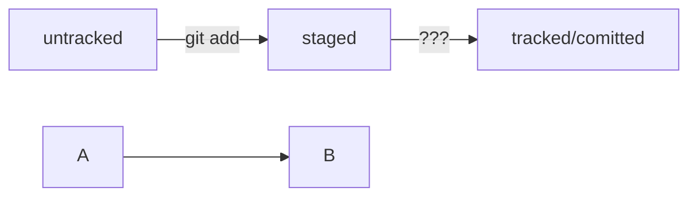

# Вот это я изучил по GIT

### Сначала нужно создать папку, где будет храниться **локальный репозиторий**:

```
$ cd ~

$ mkdir dev

$ cd ~/dev

$ mkdir first-project
```

### Затем нам нужно сделать эту папку **репозиторием**:

```
$ cd ~/dev/first-project

$ git init
```
### Теперь у нас есть локальный репозиторий! Можно добавлять туда файлы и заодно проверить их наличие командой `git status`:

```
$ touch readme.txt

$ git status 
```

### Git скажет нам, что эти файлы пока находятся в состоянии untracked, то есть он пока не следит за их изменением. Нужно это исправить с помощью `git add`

```
$ git add readme.txt
```

### А теперь можно и **коммитить** с помощью команды `git commit`! Кроме того, коммиту нужно имя, которое присваивается с помощью ключа `-m`:

```
$ git commit -m ‘Мой первый коммит!’

``` 

## Вот такие, значит, дела

----

## Теперь  то, что касается хэша, логов и HEAD. 

### **Хэш** - это странные строчки с набором букв и цифр. Появляется код, когда выводится история коммитов через команду `git log`. Например, вот:

```mermaid
$ git log
commit 528eb1e413f239cf35bba08293ea09ac46de8ac9 (HEAD -> master, origin/master)
Author: Rafail <mactavischgames3012@gmail.com>
Date:   Fri Aug 25 19:54:48 2023 +0600

    Отредачил ридми

```

### Хэш тут находится сразу после слова commit. Git создает этот набор символов с помошью алгоритма **SHA-1**. Ознакомиться с этим алгоритмом можно [здесь](https://emn178.github.io/online-tools/sha1.html "Тут SHA-1, да").

----

### "Ну а как же лог?", - нетерпеливо спросишь ты. Чуть не забыл, вот и инфа про него. **Лог** - это журнал коммитов, который вызывается с помощью не раз уже названной тут команды `git log`:

```mermaid
$ git log
commit 528eb1e413f239cf35bba08293ea09ac46de8ac9 (HEAD -> master, origin/master)
Author: Rafail <mactavischgames3012@gmail.com>
Date:   Fri Aug 25 19:54:48 2023 +0600

    Отредачил ридми

commit f99bb261fd90298e44a09f8256c879d356213798
Author: Rafail <mactavischgames3012@gmail.com>
Date:   Fri Aug 25 19:23:22 2023 +0600

    Добавил ридми про гит
```

### Лог состоит из следующих элементов:
#### строка из цифр и латинских букв после слова commit — это **хеш** коммита;
#### **Author** — имя автора и его электронная почта;
#### **Date** — дата и время создания коммита;
#### в конце находится **сообщение** коммита.

### Кроме того, можно вывести сокращенный лог с помошью команды `git log --oneline`. Выглядит это так:

```mermaid
$ git log --oneline
528eb1e (HEAD -> master, origin/master) Отредачил ридми
f99bb26 Добавил ридми про гит
```

### А еще есть **HEAD** - один из служебных файлов папки .git, которая находится в локальном репозитории. Этот файл указывает на коммит, который сделан последним (то есть на самый новый).

```mermaid
$ cd .git

$ ls
COMMIT_EDITMSG  config       hooks/  info/  next-index-4372.lock  refs/
HEAD            description  index   logs/  objects/

$ cat HEAD
ref: refs/heads/master
```

Внутри HEAD — ссылка на служебный файл: refs/heads/master (или refs/heads/main в зависимости от названия ветки). Если заглянуть в этот файл, можно увидеть хеш последнего коммита.

